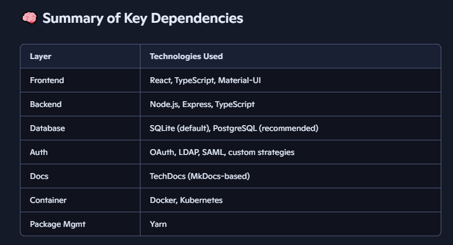

## Here we will understand how the backstage functions
🧰 Backstage Tech Stack Overview
🧑‍💻 Frontend
React: Used to build the user interface

TypeScript: Provides type safety and better developer tooling

Material-UI: For UI components and styling

Webpack: Bundles frontend assets

⚙️ Backend
Node.js: Runs the backend server

Express.js: Handles HTTP routing and middleware

TypeScript: Also used on the backend for consistency

SQLite / PostgreSQL: Default database is SQLite, but PostgreSQL is recommended for production

🔌 Plugins System
Backstage is plugin-driven, meaning features like catalog, documentation, CI/CD, and monitoring are added as plugins.

Plugins are built using the same React + Node.js stack and can be customized or created from scratch.

📦 Package Management
Yarn: Preferred package manager for installing dependencies and managing monorepo structure

🐳 Containerization
Docker: Used to containerize the Backstage app for deployment

Kubernetes: Often used for orchestration in production environments

🔐 Authentication & Authorization
Supports integrations with:

OAuth providers (Google, GitHub, etc.)

LDAP

SAML

Custom auth strategies

📚 Documentation & Search
TechDocs: Backstage’s built-in documentation generator based on MkDocs

ElasticSearch or PostgreSQL: Can be used for search indexing

🧪 Development Tools & Utilities
ESLint and Prettier: For code linting and formatting

Jest: For unit testing

Storybook: For UI component development

GitHub Actions: Commonly used for CI/CD pipelines

## Understanding the Dockerfile creation  

    https://backstage.io/docs/deployment/docker

### understanding the sub-links which are part of the Dockerfile creation link

#### 1) https://backstage.io/docs/getting-started/config/authentication/

        Copilot link -- https://copilot.microsoft.com/chats/zsCTen1X2KmmcqYBZEmBd

    